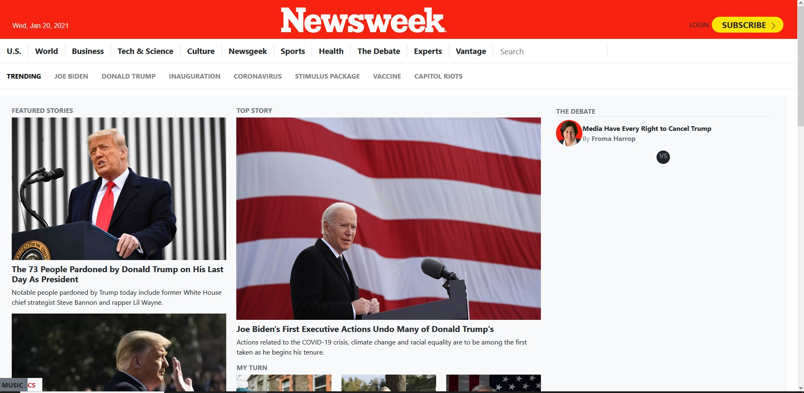

# Microverse Newsweek

> This is a clone of [Newsweek](https://thenextweb.com/) website.

This is a clone from a snapshot of the Newsweek website from January 20, 2021, it's focused on replicating a website using Bootstrap

## Built With

- HTML
- CSS
- Bootstrap

## Live Demo

[Live Demo Link](https://chuckbuckethead.github.io/microverse-newsweek/)

## Getting Started

- Run this command in your OS terminal: `git clone https://github.com/chuckbuckethead/microverse-newsweek/` to get a copy of the project.
- To run the project open the `index.html` file in a web browser.

### Prerequisites

* Internet connection
* A browser that supports HTML5 and

### Setup

* Clone the repository

### Usage

* Open index.html in your browser

### Deployment

To deploy on to github pages first push the project to a repository, then
in the project settings there is a section called github pages that will let you choose the branch that you want to deploy, after the branch is selected the project will be live on your-github-username.github.io/your-github-repo-name

## Authors

👤 **Carlos González**

- GitHub: [@chuckbuckethead](https://github.com/chuckbuckethead)
- Twitter: [@aclerkofpomier](https://twitter.com/aclerkofpomier)
- LinkedIn: [Carlos González](https://www.linkedin.com/in/chuckbuckethead/)

👤 **Camilo Patiño**

- GitHub: Camilo Patiño - [LoxiasCam](https://github.com/LoxiasCam)

## 🤝 Contributing

Contributions, issues, and feature requests are welcome!

Feel free to check the [issues page](https://github.com/chuckbuckethead/microverse-newsweek/issues).

## Show your support

Give a ⭐️ if you like this project!

## Acknowledgments

- To developers

## 📝 License

This project is [MIT](https://www.mit.edu/~amini/LICENSE.md) licensed.
